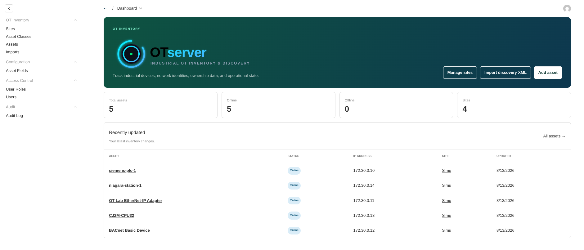
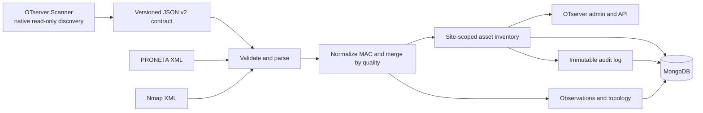

<div align="center">

# OTserver

### Self-hosted OT inventory with a purpose-built, read-only discovery scanner

Native OT discovery · Quality-aware inventory · Site-scoped access · Immutable history

[](https://otserver.org)
[](https://nextjs.org/)
[](https://www.mongodb.com/)
[](scanner/README.md)
[](LICENCE.md)

[Quick start](#quick-start) · [How it works](#how-it-works) · [Imports](#discovery-and-imports) · [Scanner](#otserver-scanner) · [Development](#development)

</div>

---

OTserver combines a trustworthy industrial inventory with its own native discovery tool. The
**OTserver Scanner** is a cross-platform Rust CLI built specifically for identifying industrial
devices through fixed, read-only protocol requests. It collects structured evidence—not just a flat
host list—and exports observations, interfaces, ports, and topology through a strict versioned
contract understood directly by the manager.

OTserver turns that evidence into a site-scoped inventory with provenance-aware
field merging, flexible hierarchies, role-based access, search, and a complete audit trail.



## What you get

- **OTserver Scanner** — Discover devices on Windows and Linux using native ARP, PROFINET
  DCP, S7, EtherNet/IP, BACnet, Omron FINS, Niagara Fox, SNMP, and LLDP requests.
- **Rich discovery evidence** — Preserve per-protocol observations, field quality, interfaces,
  ports, topology links, warnings, and partial failures in a validated JSON contract.
- **OT inventory** — Automatically track vendor, model, firmware, protocols, ownership, location,
  status, criticality, and custom fields.
- **Flexible site hierarchy** — Model regions, plants, areas, lines, cells, or any structure your
  organization uses.
- **Scoped access** — Grant read-only or read/write access to a site and all its descendants. A
  protected Admin role retains unrestricted access.
- **Discovery imports** — Ingest Siemens PRONETA XML, Nmap XML, and OTserver Scanner JSON into a
  selected site.
- **Reliable correlation** — Assets are identified only by normalized MAC address, never by a
  changeable IP address or device name.
- **Evidence-aware merging** — Higher-quality discoveries can improve lower-quality data while
  human edits remain authoritative. Protocol evidence is combined across sources.
- **Search and filters** — Use the graphical filter builder or a supported Lucene query syntax for
  precise inventory searches.
- **Traceable history** — Retain source observations and topology links alongside an immutable,
  secret-redacting audit log.

## Quick start

### Docker

Docker Engine with Compose is the shortest path to a local application and MongoDB:

```bash
cp .env.example .env
# Replace OTSERVER_SECRET in .env with a long random value.
docker compose up
```

Open <http://localhost:3000/admin> and create the first administrator account.

### Local development

Requirements: Node.js 20.9+, pnpm 9–11, and MongoDB.

```bash
cp .env.example .env
# Set DATABASE_URL and replace OTSERVER_SECRET with a long random value.
pnpm install
pnpm dev
```

Then open <http://localhost:3000/admin>. The first account receives the protected Admin role.

## First inventory

1. Create your hierarchy under **Sites**. Use any site types and nesting depth that fit the plant.
2. Add assets manually, or open **Imports → Create New** and select a discovery source.
3. Review created, updated, skipped, and unresolved records on the completed import.
4. Search the inventory or open an asset to inspect its details, observations, topology, and history.

## How it works



Every asset and import belongs to a site. During import, the application normalizes each MAC address
to uppercase colon-separated form and uses it as the sole identity key. Records without a usable MAC
address are skipped rather than attached to the wrong device.

Field values are merged in this order:

```text
human > high > medium > low
```

Empty values can always be filled. Equal-quality evidence may replace changed values, stronger
evidence may replace weaker values, and weaker evidence cannot overwrite stronger data. Manual edits
are recorded as human provenance and survive future imports.

## Discovery and imports

| Source           | Input                   | Default quality      | Best for                                                     |
| ---------------- | ----------------------- | -------------------- | ------------------------------------------------------------ |
| OTserver Scanner | Schema-version-2 JSON   | Observation-specific | Native discovery with observations, interfaces, and topology |
| Siemens PRONETA  | Topology XML            | High                 | Siemens-oriented discovery and topology exports              |
| Nmap             | XML produced with `-oX` | Medium               | Existing Nmap-based discovery workflows                      |

Import files are treated as untrusted input: parsers enforce size and structure limits, tolerate
optional vendor data, and report malformed or uncorrelatable observations as warnings. The scanner
wire contract is defined in
[`contracts/otserver-scan-v2.schema.json`](contracts/otserver-scan-v2.schema.json).

Example searches:

```text
vendor:Siemens AND status:online
protocol:profinet AND criticality:critical
site:"Plant 1" AND type:plc
lastseen:[2026-01-01 TO *]
```

## OTserver Scanner

The scanner is not a wrapper around a general-purpose scanning engine. Its discovery, protocol
framing, response validation, correlation, and export contract are implemented together for this
inventory workflow.

- **Native protocol identity** — Uses fixed queries designed to retrieve device identity without
  configuration changes, vulnerability scripts, or exploit behavior.
- **Evidence-preserving output** — Keeps protocol observations and raw source data alongside
  normalized devices instead of collapsing a scan into one guessed record.
- **Topology-aware collection** — Carries LLDP, SNMP, and PROFINET link evidence, network interfaces,
  and ports into OTserver.
- **Quality-aware by design** — Each observation reaches the importer with its source quality, so
  stronger evidence improves the inventory without overwriting human edits.
- **Predictable failure handling** — Produces valid partial results with warnings when individual
  probes fail, while malformed and unsolicited responses are rejected.

The scanner requires `--ack-authorized` before a scan. Linux uses `AF_PACKET` raw sockets and needs
root or `CAP_NET_RAW`; Windows 10+ capture uses native Win32 IP Helper and Packet Monitor (pktmon).

```bash
cd scanner
cargo build --release
sudo ./target/release/otserver-scanner doctor
sudo ./target/release/otserver-scanner scan \
  --target 192.168.1.0/24 \
  --interface eth0 \
  --source-mac 00:11:22:33:44:55 \
  --output scan.otserver.json \
  --ack-authorized
```

Only scan networks you own or are authorized to assess. The scanner does not perform configuration
writes, SNMP SET, DCP Set, brute force, exploits, vulnerability scripts, or Modbus requests.

Users can enable a Payload API key on their account. With an OTserver URL, site ID, and that key in
the scanner environment or executable-adjacent `otscanner.json`, the scanner can send its completed
JSON directly to the existing REST importer with the user's current site permissions. The local
scan file is retained.

See the [scanner guide](scanner/README.md) for Windows commands, SNMP profiles, output validation,
direct import configuration, exit codes, platform requirements, and the isolated interoperability
lab.

## Security and audit model

- Collection access rules enforce site permissions on the server; hiding an admin view is never the
  security boundary.
- Read and write permissions inherit through every descendant of the selected site.
- The protected Admin role is created automatically and cannot be renamed or deleted.
- All registered collections are audited for creates, updates, deletes, and authentication events.
- Audit entries are immutable and redact fields resembling passwords, secrets, tokens, hashes, or
  sessions.
- Scanner credentials remain in environment variables referenced by ignored SNMP profiles and are
  never included in scan exports.

## Technology

| Layer         | Technology                                                   |
| ------------- | ------------------------------------------------------------ |
| Application   | Next.js 16, React 19, TypeScript                             |
| Admin and API | OTserver, built on Payload CMS 3                             |
| Database      | MongoDB                                                      |
| Search        | Lucene subset translated to Payload queries                  |
| Scanner       | Rust, native Windows and Linux capture                       |
| Validation    | Vitest integration tests, Rust tests, isolated Docker OT lab |

## Project layout

```text
src/collections/   OTserver collections, hooks, and domain rules
src/access/        Shared site-scoped authorization
src/importers/     PRONETA, Nmap, scanner parsers, and quality merging
src/search/        Lucene query translation and graphical-filter integration
src/components/    OTserver admin views, branding, and fields
scanner/           Native read-only discovery CLI
scanner/lab/       Isolated protocol interoperability lab
contracts/         Versioned scanner/importer JSON schema
tests/int/         Application and importer integration tests
```

## Development

Run the smallest relevant check while working, then the full application suite:

```bash
pnpm test
pnpm lint
pnpm build
```

Coverage is enforced at 90% for the application and scanner library. Install
`cargo-llvm-cov`, then run both gates from the repository root:

```bash
cargo install cargo-llvm-cov
pnpm test:coverage
```

Scanner checks:

```bash
cd scanner
cargo fmt -- --check
cargo check --locked
cargo test --locked
cargo clippy --locked --all-targets -- -D warnings
cd ..

./scanner/lab/test.sh
```

Regenerate OTserver's Payload artifacts after schema or admin component changes:

```bash
pnpm generate:types
pnpm generate:importmap
```

## License

OTserver and OTserver Scanner are dual-licensed:

The open-source core will remain open source: the scanner, all detection
needed to find assets and device capabilities, and the base asset-management
interface features. Enterprise offerings may add optional proprietary add-ons,
such as SSO integrations or customized dashboards; they do not replace or
restrict the open-source core.

1. **Open Source (GNU AGPLv3):** available under the
   [GNU Affero General Public License v3](LICENCE.md). If you run a modified
   version on a server and let users interact with it over a network, you must
   make your modified source code available under the AGPLv3.
2. **Commercial License:** available for enterprises, SaaS providers, or
   organizations integrating OTserver into proprietary systems without the
   AGPLv3 copyleft obligations.

For a commercial license, custom SLA support, enterprise features, or help
choosing the right license, visit [otserver.org/enterprise](https://otserver.org/enterprise/).
